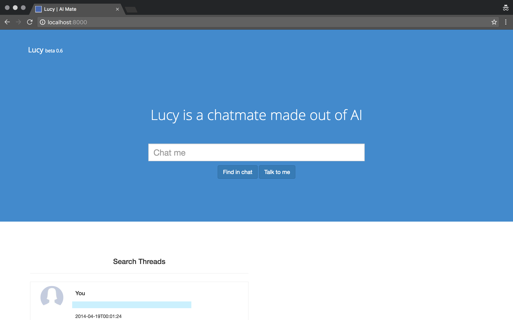
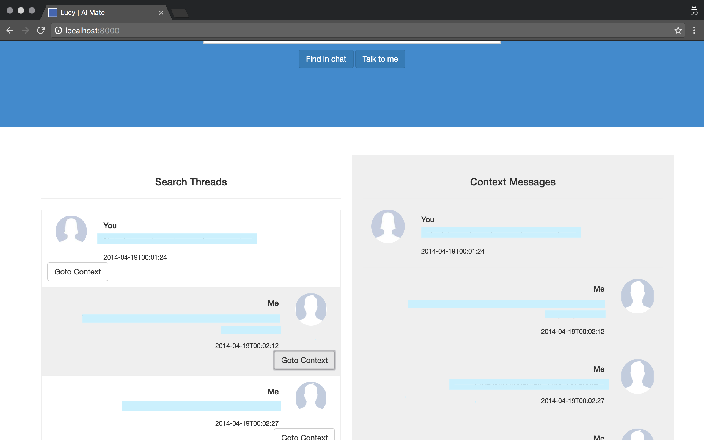

# chatter 

chatter is the offline chat application, that reads the exported 
whatsapp chat and talks to you!

Im sad to say, that the AI part is not implemented, I wish I could spend
more time to implement AI into these chats.

## Setup the server 

1. Install MongoDB
2. `git clone https://github.com/rrmerugu/whatsapp-chatter`
3. `cd whatsapp-chatter`
4. `virtualenv venv`
5. `source venv/bin/activate`
6. `pip install -r requirements.txt`
7. `python manage.py runserver`

## How to use

1. Export the whatsapp data to email 
2. Copy the text from email into *.txt file(s)
3. Import the data from *.txt files using the script `scripts/import_chat.py`

 -----
 
## Implementation Notes for Developer:
1. find your word
2. find buffer data around ur word ie., n messages before and after 
the match message
3. show all the instances 
